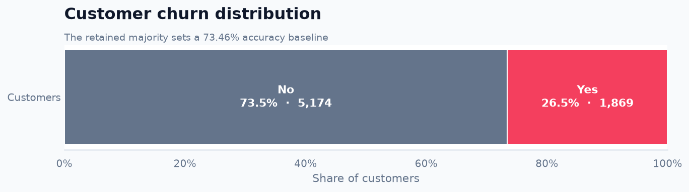
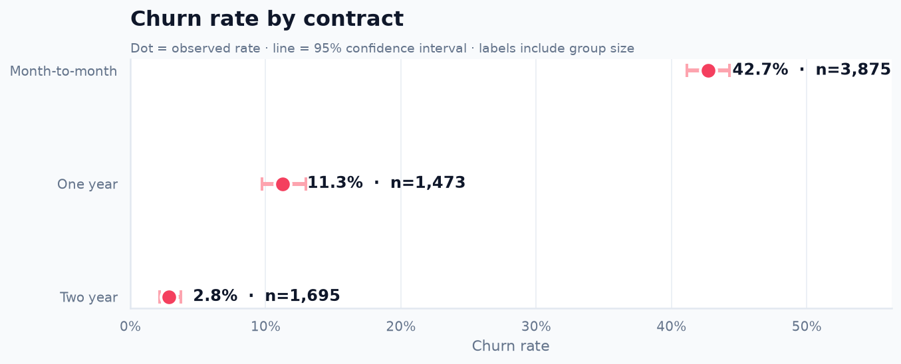
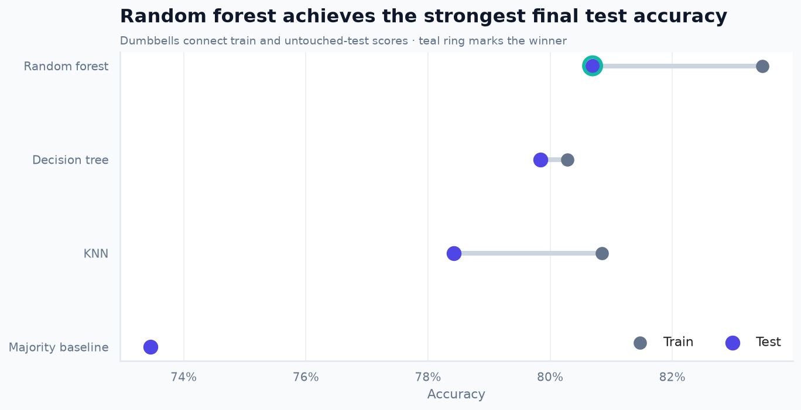
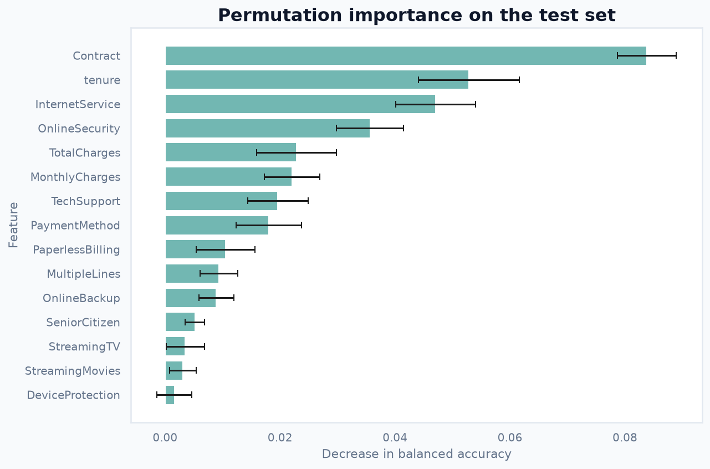

<div align="center">

# Customer Churn Prediction

**A reproducible machine-learning study of which customers are likely to leave**

[](https://www.python.org/)
[](final_project.ipynb)
[](https://scikit-learn.org/)
[](LICENSE)

[Notebook](final_project.ipynb) ·
[Presentation](final_project_presentation.pptx) ·
[Assignment](TASK.md) ·
[Submission checklist](SUBMISSION_CHECKLIST.md)

</div>

---

This project predicts telecommunications customer churn from demographic,
service, contract, and billing data. It combines careful data validation, six
focused exploratory views, leakage-safe model selection, and interpretable
model artifacts in one end-to-end notebook.

**Project team:** Menachem Twersky · Roni Reichbard · Sapir Pirski

## Results at a glance

| Dataset | Predictive features | Models compared | Best test accuracy |
|:--:|:--:|:--:|:--:|
| **7,043 customers** | **19** | **3 + baseline** | **80.70%** |

| Question | Answer |
|:--|:--|
| **Target** | Whether a customer leaves: `Churn = Yes` |
| **Inputs** | Demographics, tenure, services, contract, billing, and charges |
| **Validation** | Five-fold stratified cross-validation on the training set |
| **Final evaluation** | One untouched, stratified 20% test set |
| **Required models** | K-nearest neighbors, decision tree, and random forest |
| **Selected model** | Random forest |

> The random forest achieves the highest test accuracy, but its 51.07% churn
> recall shows why accuracy must be interpreted alongside class-specific
> metrics.

## Visual story

| Customer outcomes | Contract risk |
|:--:|:--:|
|  |  |
| **Most customers remain**, creating a 73.46% majority-class baseline. | **Month-to-month customers show the highest observed churn rate.** |

| Model comparison | Model interpretation |
|:--:|:--:|
|  |  |
| **Random forest leads on test accuracy** without the extreme overfitting of an unrestricted tree. | **Contract and tenure carry the strongest predictive signal** on unseen customers. |

Other notebook findings:

- Churn is concentrated among customers with shorter tenure.
- Churned customers tend to have higher monthly charges.
- Fiber-optic service is associated with higher churn in this dataset.
- Electronic-check payment is associated with higher churn.

These are predictive associations, not causal effects.

## Model comparison

All preprocessing and hyperparameter choices are fitted using training folds
only. The held-out test set is evaluated after model selection.

| Model | Train accuracy | Test accuracy | Churn recall | Churn precision | PR-AUC |
|:--|--:|--:|--:|--:|--:|
| Majority baseline | 73.46% | 73.46% | N/A | N/A | N/A |
| KNN | 80.85% | 78.42% | 58.29% | 59.56% | 60.89% |
| Decision tree | 80.28% | 79.84% | 56.68% | 63.47% | 62.33% |
| **Random forest** | **83.48%** | **80.70%** | 51.07% | **68.21%** | **65.78%** |

The notebook also reports balanced accuracy, F1, ROC-AUC, MCC, normalized
confusion matrices, confidence intervals, and subgroup error rates.

## Analysis workflow

```text
Raw data
   │
   ├── Validate schema, values, duplicates, and consistency
   ├── Repair blank TotalCharges values
   ├── Create a stratified 80/20 train–test split
   │
   └── Training data only
          ├── Fit preprocessing inside each pipeline
          ├── Compare candidate engineered features
          ├── Tune KNN, decision tree, and random forest
          └── Select hyperparameters with stratified cross-validation
                     │
                     └── Evaluate once on the untouched test set
```

### What the notebook contains

1. **Problem definition** — prediction target, inputs, motivation,
   applications, and limitations.
2. **Data validation** — schema, duplicate checks, category values, numeric
   ranges, and cross-field consistency.
3. **Data description** — sample counts, feature count, class balance, missing
   values, and six core visualizations.
4. **Data engineering** — identifier removal, missing-value repair, defensive
   pipeline imputation, and feature-ablation experiments.
5. **Required algorithms** — multiple `k` values, tree depths, forest depths,
   and forest estimator counts.
6. **Model introspection** — tree diagrams, impurity importance, permutation
   importance, confusion matrices, and error analysis.

## Data decisions

### Missing values

`TotalCharges` contains 11 blank strings that ordinary null detection does not
identify. Every affected customer has zero tenure, so these values are
converted to zero. Median imputation remains inside each model pipeline as a
defensive fallback for future data.

### Removed feature

`customerID` is excluded from modeling because it is unique for every row and
cannot describe behavior that generalizes to unseen customers.

### Candidate engineered features

Lifecycle, service-count, automatic-payment, and interaction features are
evaluated through cross-validated ablation. The original 19 predictive
features perform best, so the candidates are documented but not retained in
the final models.

## Quick start

The launchers detect the operating system, prepare Python 3.12, create `.venv`,
synchronize locked dependencies, execute every notebook cell, validate the
saved notebook, and open JupyterLab.

### macOS, Linux, or Git Bash

```bash
./run-full-project.sh
```

### Windows PowerShell

```powershell
Set-ExecutionPolicy -Scope Process Bypass
.\run-full-project.ps1
```

### Useful options

| Purpose | macOS/Linux/Git Bash | Windows PowerShell |
|:--|:--|:--|
| Execute and validate without opening JupyterLab | `./run-full-project.sh --no-open` | `.\run-full-project.ps1 -NoOpen` |
| Reuse an already prepared environment | `./run-full-project.sh --skip-install` | `.\run-full-project.ps1 -SkipInstall` |
| Force dependency synchronization | `./run-full-project.sh --force-sync` | `.\run-full-project.ps1 -ForceSync` |

> **Internet and permissions:** Automatic installation of Python 3.12, `uv`,
> and project dependencies requires internet access. The operating system may
> request administrator approval when installing Python through Homebrew,
> Windows Package Manager, or another package manager.

On a normal run, the launcher compares a fingerprint of `pyproject.toml` and
`uv.lock` with the existing environment. It skips dependency synchronization
when the fingerprint, Python version, and Jupyter installation already match.

## Reproducibility

- Python 3.12 is required.
- `pyproject.toml` pins direct dependencies.
- `uv.lock` records exact direct and transitive versions with artifact hashes.
- `requirements.txt` provides a fully hashed compatibility export for `pip`.
- Randomized operations use `random_state=42`.
- The train/test split preserves the target distribution.
- Preprocessing is fitted independently inside each training fold.
- The launcher stops if any notebook cell fails.
- Post-execution validation checks the environment, dataset, notebook outputs,
  required sections, plots, and algorithm artifacts.
- Project-local Matplotlib and IPython caches prevent environment-specific
  warning output from entering the notebook.

To intentionally update dependencies:

```bash
uv lock --upgrade
uv export --frozen --no-dev --no-emit-project \
  --format requirements-txt --output-file requirements.txt
```

## Project structure

```text
.
├── data/
│   └── churn.csv
├── docs/
│   └── images/                      # Notebook plots used in this README
├── scripts/
│   └── validate_project.py          # Post-execution validation
├── final_project.ipynb              # Executed end-to-end analysis
├── final_project_presentation.pptx  # Assignment presentation
├── pyproject.toml                   # Direct dependencies and Python constraint
├── uv.lock                          # Cross-platform dependency lock
├── requirements.txt                 # Hashed pip compatibility export
├── run-full-project.sh              # macOS, Linux, and Git Bash launcher
├── run-full-project.ps1             # Native Windows launcher
├── SUBMISSION_CHECKLIST.md
├── CONTRIBUTORS.md
├── TASK.md
└── LICENSE
```

## Limitations

- The dataset is a fictional, point-in-time sample supplied with the course
  project.
- Predictive importance does not establish causality.
- The selected model misses some churners despite achieving the best accuracy.
- Performance must be revalidated before applying this workflow to another
  customer population.

## Project documents

- [Executed notebook](final_project.ipynb)
- [Presentation](final_project_presentation.pptx)
- [Assignment](TASK.md)
- [Submission checklist](SUBMISSION_CHECKLIST.md)
- [Contributors](CONTRIBUTORS.md)
- [MIT License](LICENSE)
